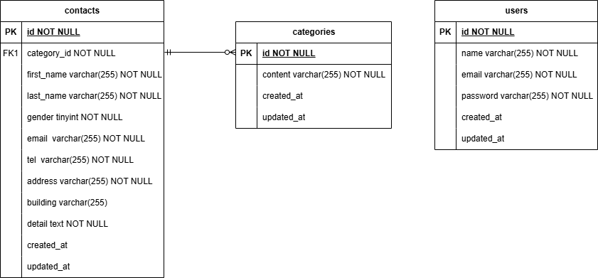

# アプリケーション名

- Contact Form

## Dockerビルド

- git clone
- docker compose up -d --build

## 環境構築

- docker compose exec php bash
- composer install
- cp .env.example .env ,環境変数を適宜変更
- php artisan key:generate
- php artisan migrate
- php artisan db:seed

## 使用技術(実行環境)

- PHP 8.1
- Laravel 8.x
- MySQL mysql:8.0.26
- nginx 1.21.1
- Docker / Docker Compose
- phpMyAdmin

## ER図

## URL

- お問い合わせフォーム入力画面：http://localhost/
- ユーザ登録画面：http://localhost/register
- phpMyAdmin：http://localhost:8080/
